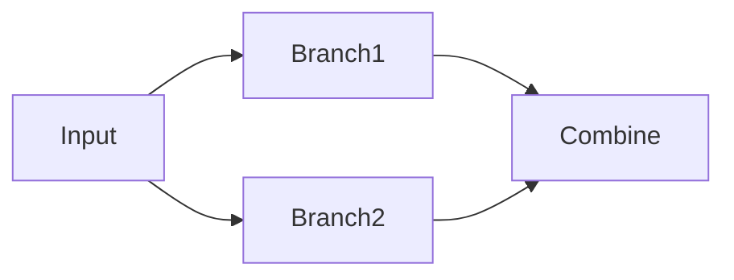

# Using Langchain with Anthropic Models on Amazon Bedrock

## Sequential calls to LLMs

## Quick Links

- [Langchain Sequential Chains](./anthropic-sequential-chains.ipynb)
- [Multi-prompt Router Chains](./anthropic-router-chains.ipynb)
- [Model kwargs for various Bedrock Models](./utils.py)
