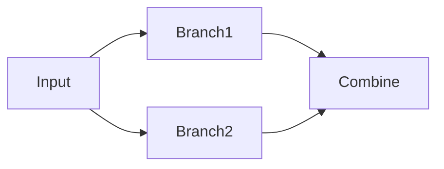
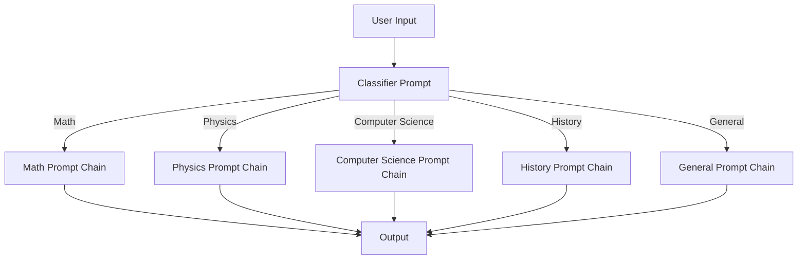

# Using Langchain with Anthropic Models on Amazon Bedrock

## Sequential calls to LLMs

Refer to notebook: [Langchain Sequential Chains](./anthropic-sequential-chains.ipynb)

## Classify and Route questions to various Prompts

Refer to notebook: [Multi-prompt Router](./anthropic-router-chains.ipynb)

> [!WARNING]
> The above notebooks also contain *LEGACY* implementations only for demonstration purposes. LCEL is the preffered way.

### Quick Links

- [Model kwargs for various Bedrock Models](../utils/utils.py)
