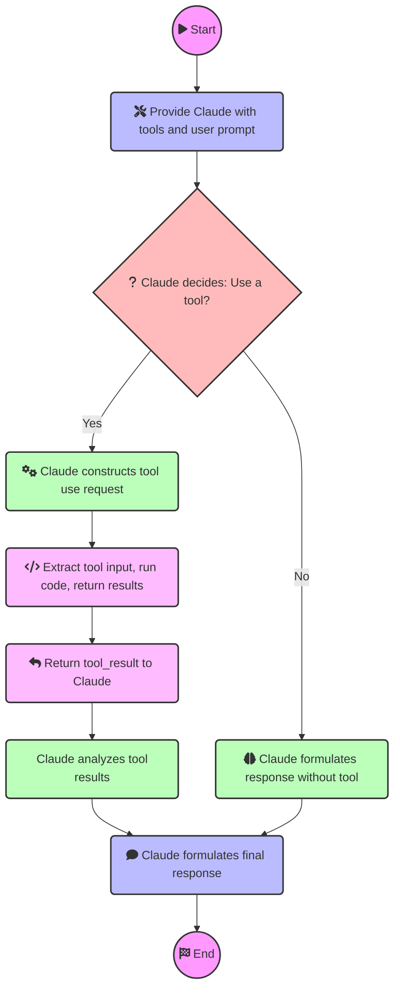

# How Tool Use Works (Claude v3)

Integrate external tools with Claude using the following steps:

## 1. Provide Claude with Tools and User Prompt

- Define tools with `names`, `descriptions`, and `input_schemas` in your API request.
- Include a user prompt that might require these tools, e.g., "What's the weather in San Francisco?"

```python
tools = [
    {
        "name": "calculator",
        "description": "A simple calculator that performs basic arithmetic operations.",
        "input_schema": {
            "type": "object",
            "properties": {
                "expression": {
                    "type": "string",
                    "description": "The mathematical expression to evaluate (e.g., '2 + 3 * 4').",
                }
            },
            "required": ["expression"],
        },
    },
```

## 2. Claude Decides to Use a Tool

- Claude assesses if any tools can help with the user's query.
- If yes, Claude constructs a properly formatted tool use request.
- The API response has a `stop_reason` of `tool_use`, signaling Claude's intent.

**Note:** We can force claude to use a specific tool with the `tool_choice` parameter.

```python
def analyze_tweet_sentiment(query):
    response = client.messages.create(
        model=MODEL_NAME,
        max_tokens=4096,
        tools=tools,
        tool_choice={"type": "tool", "name": "print_sentiment_scores"},
        messages=[{"role": "user", "content": prompt}]
    )
    print(response)
```

## 3. Extract Tool Input, Run Code, and Return Results

- On your end, extract the tool name and input from Claude's request.
- Execute the actual tool code client-side.
- Continue the conversation with a new user message containing a `tool_result` content block.

## 4. Claude Uses Tool Result to Formulate a Response

- Claude analyzes the tool results to craft its final response to the original user prompt.

---

